# 📚 Atividade A3 – Sistemas Distribuídos e Mobile

## 🎯 Tema da Atividade

Construção de uma API RESTful com Acesso a Banco de Dados Relacional (MySQL).

Eu utilizei Node.js, Express, Sequelize e Docker.

O projeto segue os princípios da arquitetura REST conforme especificado por Roy Fielding:

- ✅ Client-Server
- ✅ Stateless
- ✅ Cacheable
- ✅ Uniform Interface
- ✅ Layered System

## 🚀 Tecnologias Utilizadas
- Node.js
- Express
- Sequelize ORM
- MySQL
- Docker + Docker Compose
- Bash Script (start.sh para automação)
- Postman (para testes dos endpoints)

## 🛠️ Como Executar o Projeto

### 1. Clone o Repositório e entre na raiz do projeto

```bash
git clone https://github.com/jonathasreuel/A3_sistemas_distribuidos_mobile_825110467.git
cd A3_sistemas_distribuidos_mobile_825110467
```

### 2. Conceda Permissão de Execução ao Script de Inicialização

```bash
sudo chmod +x start.sh
```

### 3. Caso não possua, instale o Docker Engine e Docker Compose
1. [Instalação Docker Engine](https://docs.docker.com/engine/install/)

2. [Instalação Docker Compose](https://docs.docker.com/compose/install/)

### 4. Inicie o Projeto

```bash
./start.sh
```

Esse processo pode levar alguns minutos na primeira execução, pois o Docker fará o download das imagens.

## ✅ Endpoints Disponíveis

### Entidade: Cliente

| Método | Endpoint        | Descrição                      |
| ------ | --------------- | ------------------------------ |
| GET    | /clientes        | Listar todos os clientes       |
| GET    | /clientes/:id    | Buscar cliente por ID          |
| POST   | /clientes        | Criar novo cliente             |
| PUT    | /clientes/:id    | Atualizar cliente              |
| PATCH  | /clientes/:id    | Atualização parcial de cliente |
| DELETE | /clientes/:id    | Remover cliente                |

### Entidade: Carro

| Método | Endpoint      | Descrição                      |
| ------ | ------------- | ------------------------------ |
| GET    | /carros        | Listar todos os carros        |
| GET    | /carros/:id    | Buscar carro por ID           |
| POST   | /carros        | Criar novo carro              |
| PUT    | /carros/:id    | Atualizar carro               |
| PATCH  | /carros/:id    | Atualização parcial de carro  |
| DELETE | /carros/:id    | Remover carro                 |

## 🧹 Cache HTTP

Os endpoints GET possuem cache de 180 segundos:

```http
Cache-Control: public, max-age=180
```

## 📸 Printscreens do Postman

### Home da API (index.js)
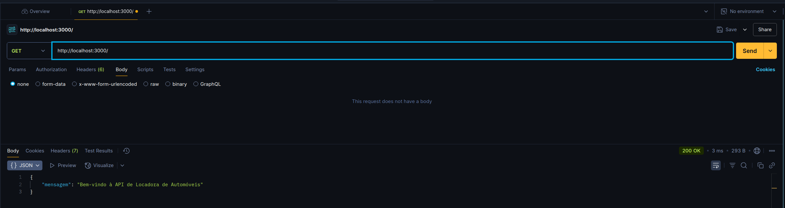

### Clientes
- GET /clientes
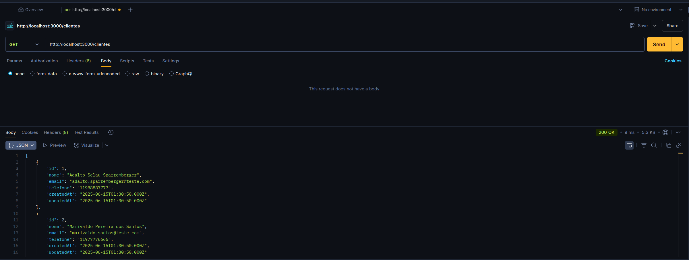
- GET /clientes/:id
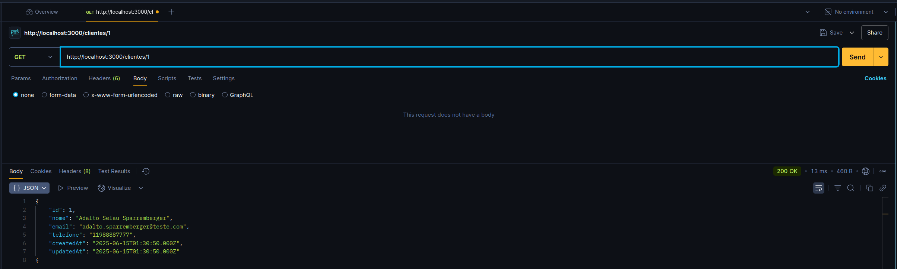
- POST /clientes
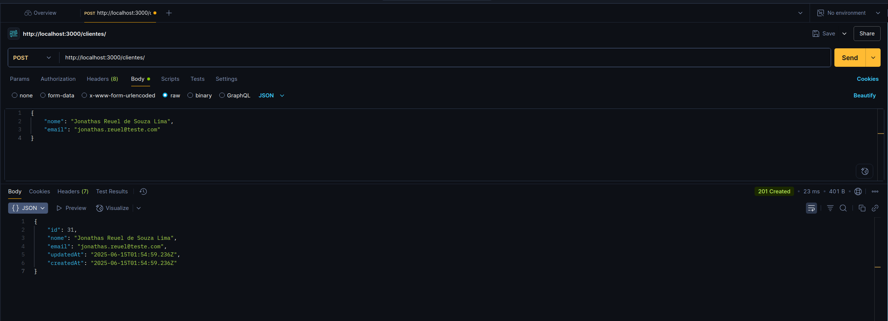
- PUT /clientes/:id
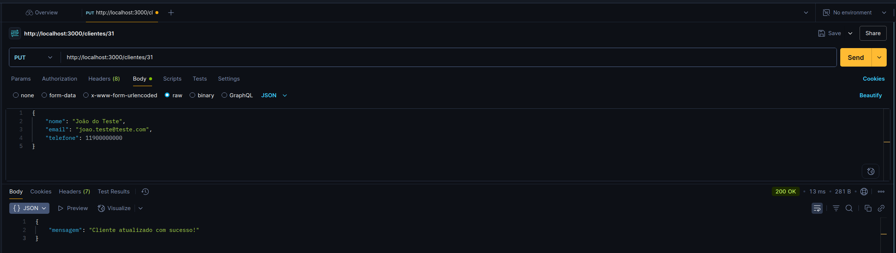
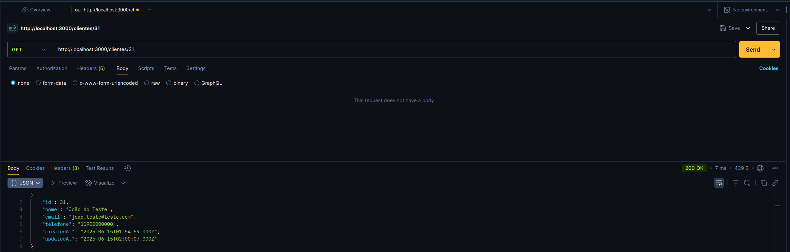
- PATCH /clientes/:id
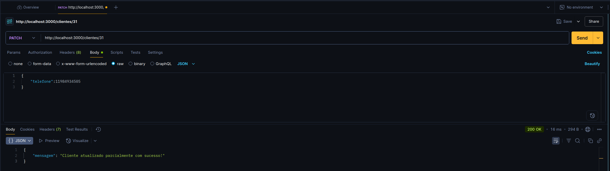
- DELETE /clientes/:id


### Carros
- GET /carros
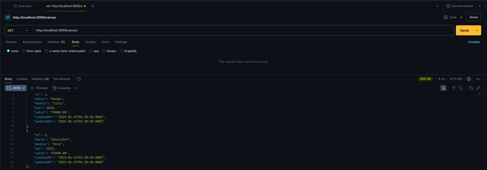
- GET /carros/:id
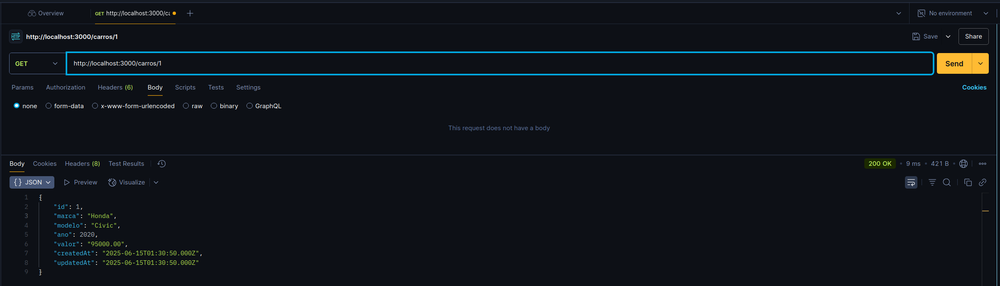
- POST /carros
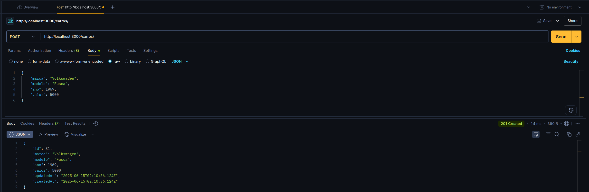
- PUT /carros/:id
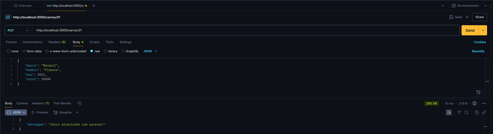

- PATCH /carros/:id
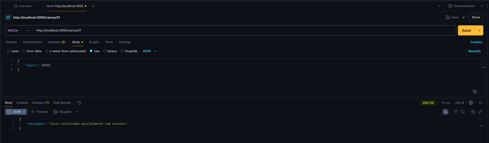
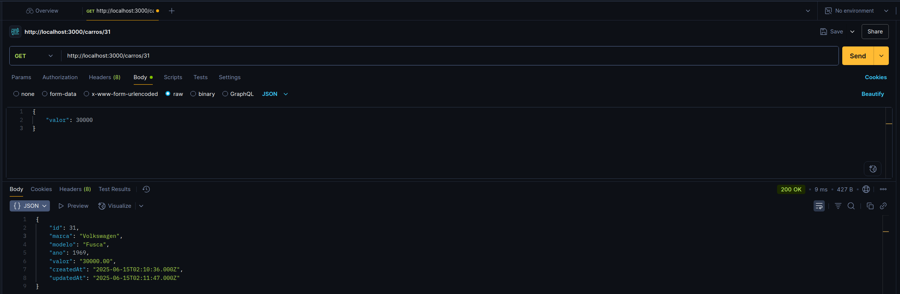
- DELETE /carros/:id

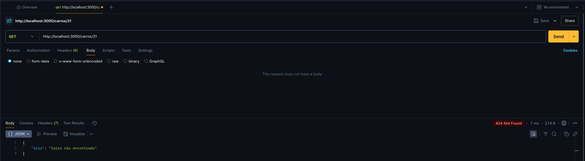

## ✅ Considerações Finais

Projeto atende todos os requisitos da A3.

👨‍💻 Desenvolvido por: Jonathas Reuel de Souza Lima (825110467)

🎥 [Link da Apresentação no Youtube](https://www.youtube.com/watch?v=eZ5D8TkqSIw)

📅 Data de entrega: 15 de Junho de 2025
